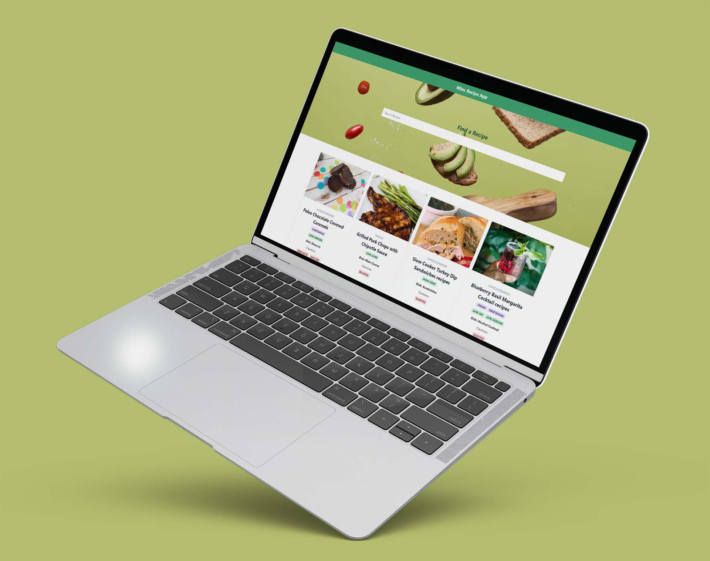

# Winc Recepies App

I built this app as a part of the completion of React Basics. By completing this project, I gained hands-on experience with various React concepts and techniques. I learned how to effectively manage state within my app, allowing me to keep track of user interactions and dynamically update the UI based on their inputs. Additionally, I honed my skills in component composition, leveraging the power of reusable and modular components to build a well-structured app architecture.

Implementing the search function was a valuable learning experience. I discovered how to efficiently filter and display data based on user-defined criteria, such as recipe names and health labels. This feature greatly enhances the user experience, as it enables them to easily find recipes that align with their dietary preferences or restrictions.

Developing the RecipeListPage and RecipePage components was an exciting challenge. I successfully created a multi-page app where users can seamlessly navigate between the recipe list and detailed recipe information. By allowing recipe items to be clickable, I made it convenient for users to explore and select recipes of their choice.

Styling the app using Chakra UI was a game-changer. The pre-built components and styling utilities provided by Chakra UI made it effortless to create visually appealing and responsive user interfaces. With Chakra UI, I was able to focus more on the functionality of the app while ensuring a polished and professional look.

Overall, this project expanded my knowledge and skills in React development. It allowed me to apply the foundational concepts I learned in React Basics and gave me the confidence to tackle more advanced topics in the future. I'm excited to continue building on this foundation and take my React skills to the next level.

# Table of contents

- [Overview](#overview)
- [Screenshots](#screenshot)
- [Links](#links)
- [My Process](#my-process)
- [What I Learnt](#what-i-learned)
- [Continued Development](#continued-development)
- [Author](#author)

# Overview

### Requirements

- Built a search function that filters based on the name and/or health labels (vegan/vegetarian/pescetarian/gluten-free/sesame-free/etc.).
- Create the <RecipePage /> component and make it display more detailed information about a selected recipe:

  Recipe name
  A picture of the recipe/meal
  Meal type
  Dish type
  Total cooking time
  Diet label
  All health labels
  Cautions
  Ingredients
  Servings

  Total nutrients (Energy in kcal, protein, fat, carbs, cholesterol, sodium)

- The items in the list (<RecipeListPage />) should be clickable and, once selected show a more detailed <RecipePage /> component. The user can also click on a back button in <RecipePage /> to return to the recipes overview.
- Style and make your app responsive using ChakraUI, which is already installed.

# Screenshot

# Links

# My Process

- [Built with](#built-with)
- [What I Learned](#what-i-learned)
- [Continued development](#continued-development)
- [Useful resources](#useful-resources)

### Built with

- React
- Chakra
- Mobile-first workflow
- Responsive Website

### What I Learned

- State Management: React provides various approaches to managing state, including useState, useContext, and useReducer hooks. Understanding when and how to use these hooks effectively can be challenging, especially when dealing with complex application state.

- Conditional Rendering: React allows you to conditionally render components based on certain conditions. This can involve using conditional statements, ternary operators, or logical operators to determine which components should be displayed. Mastering conditional rendering techniques is crucial for creating dynamic and interactive UIs.

- Handling Events: React uses a synthetic event system to handle user interactions. Understanding how to properly handle events, pass data, and update state based on user actions can be tricky. It's important to grasp concepts like event handlers, event binding, and event propagation.

- Component Lifecycle: React components have a lifecycle that includes mounting, updating, and unmounting phases. The introduction of hooks in React has simplified the component lifecycle, but it's still essential to understand concepts like useEffect for managing side effects and handling component lifecycle events.

- Routing: Implementing routing in a React application allows for navigation between different views or pages. React Router is a popular library for managing routing in React. Learning how to set up routes, handle route parameters, and navigate between different components can be challenging, especially when combined with state management.

- Component Composition: React encourages component composition, which involves building small, reusable components and combining them to create larger components and UIs. Mastering component composition techniques, such as props drilling, component hierarchies, and component reuse, can lead to more maintainable and scalable code.

- Performance Optimization: React provides tools and techniques for optimizing the performance of your application. This includes memoization, useCallback, useMemo, and shouldComponentUpdate (for class components). Understanding when and how to apply these optimizations can significantly improve the efficiency of your React application.

### Continued Development

- React Hooks: Dive deeper into hooks and explore more advanced hooks like useRef, useContext, useReducer, and custom hooks. Understanding these hooks can help you optimize your code, handle complex state management scenarios, and create custom reusable hooks.

- Context API: Explore the Context API in more depth to create and manage global state that can be accessed by multiple components without the need for prop drilling. Learn about advanced techniques like context composition and dynamic contexts.

- React Performance: Dive into performance optimization techniques in React, such as code splitting, lazy loading, and using React.memo to prevent unnecessary re-renders. Learn about performance profiling and use tools like React DevTools and performance monitoring libraries to identify and address performance bottlenecks.

- Server-Side Rendering (SSR): Learn about server-side rendering and frameworks like Next.js that enable server-side rendering in React applications. Understand the benefits of SSR, SEO optimizations, and how to implement server-side rendering in your projects.

- React Router: Explore more advanced features of React Router, such as nested routing, route guards, and handling asynchronous data fetching with routes. Learn about navigation patterns and how to handle dynamic routes and URL parameters.

- Forms and Form Libraries: Dive into form handling in React, including form validation, form state management, and handling form submissions. Explore popular form libraries like Formik or React Hook Form to streamline your form development process.

- React Testing: Learn about different testing techniques and libraries for testing React components, including unit tests, integration tests, and end-to-end tests. Explore testing frameworks like Jest and testing utilities like React Testing Library or Enzyme.

- Advanced State Management: Go beyond useState and explore more advanced state management solutions like Redux or MobX. Understand the principles behind these libraries and how to integrate them into your React applications.

- React Patterns and Best Practices: Dive into common patterns and best practices in React development, such as component composition, data fetching strategies, error handling, and separation of concerns. Explore code organization techniques, folder structures, and architectural patterns like container and presentational components.

## Author

- Linkedin - [Beaula Ekka-linkedin](https://www.linkedin.com/in/beaula-ekka-favejee-97316558/)
- Frontend Mentor - [@BeaulaEkka](https://www.frontendmentor.io/profile/BeaulaEkka)
